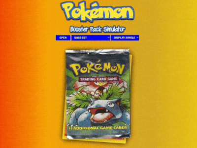

[comment]: <> (to publish to neocities with the CLI run:)
[comment]: <> (neocities push .)
[comment]: <> (for single file, e.g. Upload img.jpg to the 'images' directory)
[comment]: <> (neocities upload -d images img.jpg)
# pokemon-booster-pack-simulator
Made with JavaScript, HTML, and CSS, this web application accurately captures the probability, rarity distribution, and experience of the first dozen+ sets.

# goals
The only way to open original packs of actual Pokemon cards is either to spend hundreds of dollars on eBay or to watch YouTubers enjoy the process for you. I wanted to recreate that experience virtually and for free. It's now one of the most popular sites on Neocities. Mobile responsive.

# try it yourself!
https://pokemonboosterpack.com/

